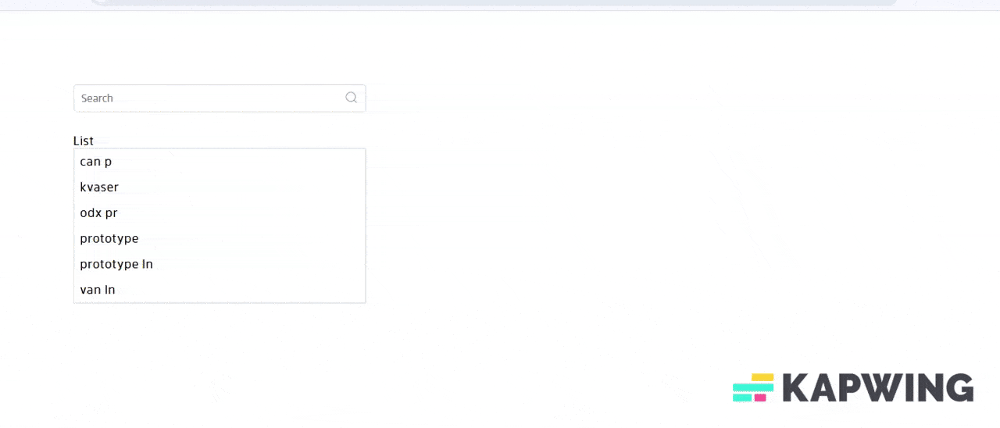

# react-search-input-zn

A lightweight and customizable **React search input** component with:

- ✅ Support for searching list
- 🔍 Searchable, filterable options
- ✨ Clean, flexible, and accessible UI

---

## Demo

<!--  -->


## Installation

```bash
npm install react-search-input-zn
```

## Import CSS

To apply default styles, import the CSS in your entry/root file:

```bash
import "react-search-input-zn/dist/index.css";
```

## Usage in ReactJs

```bash
import React, { useState } from "react";
import ReactSearchBox from "react-search-input-zn";
import "react-search-input-zn/dist/index.css";

const [data,setData]=useState([
  { name: "mango", price: "200" },
  { name: "apple", price: "160" },
  { name: "banana", price: "120" },
];)

function App() {
  const [result, setResult] = useState([]);
   const handleChange = (search) => {
      setMainData(search);
   };
  return (
    <ReactSearchBox
      data={data}
      handleChange={handleChange},
      matchesWith={["name", "price"]}
      //optional
      styles={{
      backgroundColor: "#ddd",
      borderRadius: "50px",
      margin: "0px",
      padding: "10px",
      width: "400px",
    }}
    />
  );
}

export default App;


```

## Props

| Prop           | Type       | Default            | Description                                                                    |
| -------------- | ---------- | ------------------ | ------------------------------------------------------------------------------ |
| `data`         | `array`    | `[]`               | Array of items to search (objects with any structure).                         |
| `handleChange` | `function` | `null`             | Callback function triggered when a user search.                                |
| `matchesWith`  | `array`    | `["name","price"]` | Keys in `data` objects to match user input against (e.g. `["name", "price"]`). |
| `searchLabel`  | `string`   | `"Search"`         | Placeholder text shown in the search input field.                              |
| `styles`       | `object`   | `{}`               | Optional inline CSS styles for customizing the input container.                |
